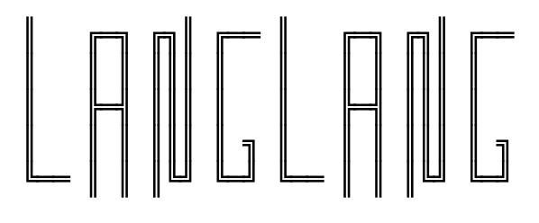

## [langlang.tech](https://langlang.tech)

I have a blog on my website. View it [here](https://langlang.tech/blog).

LangLang is coded with HTML, CSS, and JavaScript. Special shout-out to [Kaz Malhotra](https://github.com/KazMalhotra) and [W3Schools](https://www.w3schools.com/html/) for helping me get this started.

***

### Thank you for visiting my website and have a great day!

###### Quicklinks: [Blog](https://langlang.tech/blog); [Projects](https://langlang.tech/projects.html); [Stupid dinosaur jokes](https://kazmal.tech/dino); [福](https://langlang.tech/assets/img/福); [DTML (WIP)](https://langlang.tech/dtml)

###### My friends' websites: [Kaz Malhotra](https://kazmal.tech); [Theo Butler](https://the-o.tech)

###### Contact info: [GitHub](https://github.com/KazZBodnar); [Keybase](https://keybase.io/kbodnar); [Reddit](https://reddit.com/u/KazBodnar); [Discord](https://discordapp.com/users/578393519958523934); [Email](mailto:langers@catlin.edu)
